<div align="center">


# Ấm Trà

### The Vietnamese way of tea

*Nhất thủy, nhì trà, tam bôi, tứ bình, ngũ quần anh* — "water, tea, cup, pot, good company"

A single scrolling page about Vietnamese tea culture: seven teas on a spinning tray, an interactive 3D tea set, the old Hà Nội way of brewing, and the manners of offering a cup.

<br />


<br />

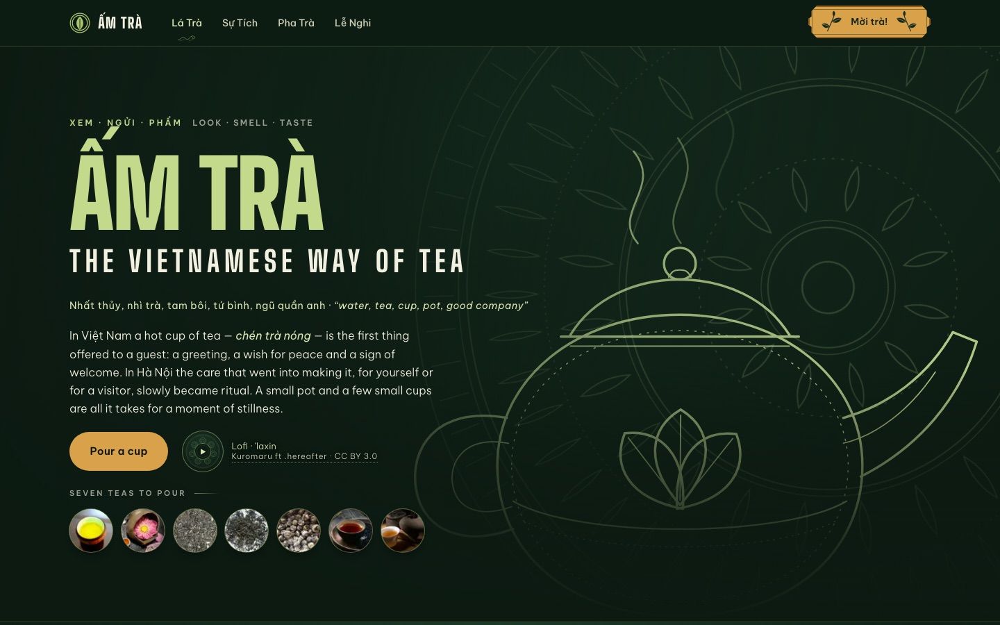

</div>

---

## About

In Việt Nam a hot cup of tea — *chén trà nóng* — is the first thing offered to a guest: a greeting, a wish for peace and a sign of welcome. **Ấm Trà** ("the teapot") is a small love letter to that custom, built as one long, slow page you scroll the way you would sip.

The text is in English, with Vietnamese terms woven in and glossed, so a reader who has never been to Việt Nam can follow along while still meeting the real words: *trà mạn*, *khay trà*, *lễ nghi*, *mời trà*.

It covers:

- **Seven teas**, from wild Shan *tuyết* trees and smoky *trà mạn* to Thái Nguyên green tea, lotus and jasmine teas scented in Hà Nội, oolong and export black tea.
- **A short history**, from the wild forests of the north to the plantations and the tea houses of Hà Nội.
- **How to brew**, step by step, the traditional Hà Nội way.
- **Six rules of the pot** — the manners of pouring, sharing and receiving tea.

The layout is inspired by [Mâm Cơm — the Vietnamese family rice tray](https://the-family-rice-tray.vercel.app/), with the subject swapped for tea.

## Preview

<table>
  <tr>
    <td width="50%">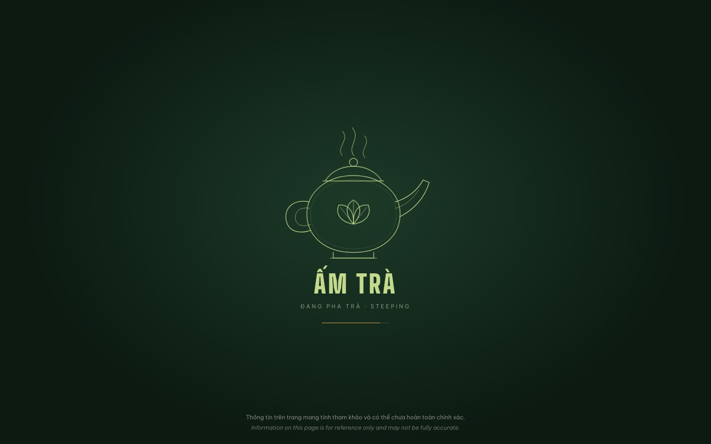</td>
    <td width="50%">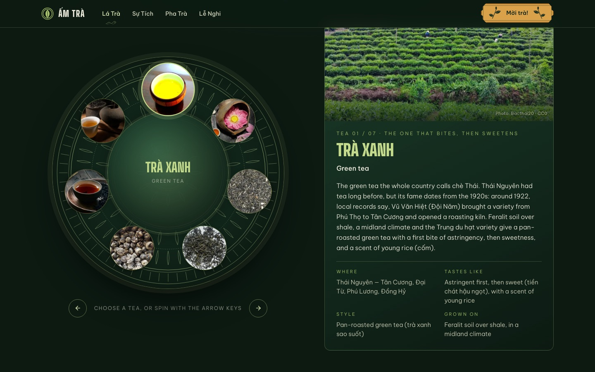</td>
  </tr>
  <tr>
    <td align="center"><b>Loading screen</b><br />The teapot draws itself while the page loads.</td>
    <td align="center"><b>Seven teas on a circle</b><br />Spin the tray; each cup opens a detail card.</td>
  </tr>
  <tr>
    <td width="50%">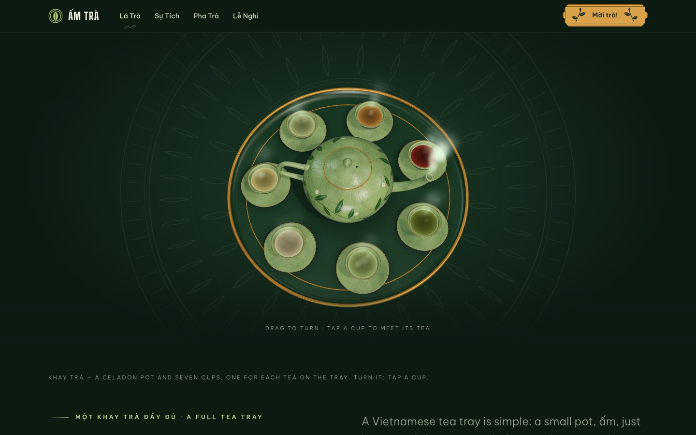</td>
    <td width="50%">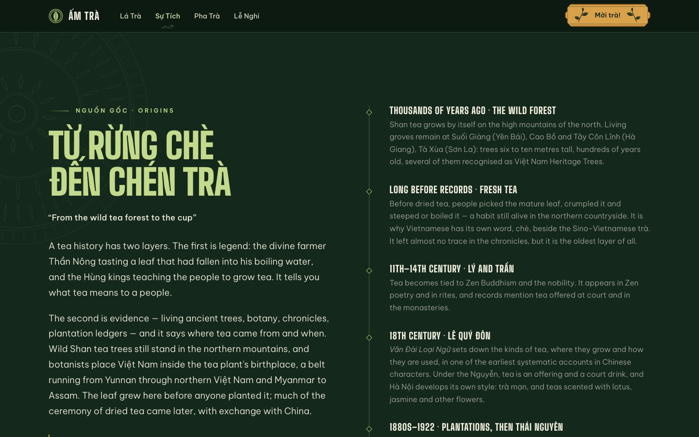</td>
  </tr>
  <tr>
    <td align="center"><b>A full tea tray</b><br />A 3D celadon pot and seven cups. Drag to turn.</td>
    <td align="center"><b>Từ rừng chè đến chén trà</b><br />A timeline from the wild forest to the cup.</td>
  </tr>
  <tr>
    <td width="50%">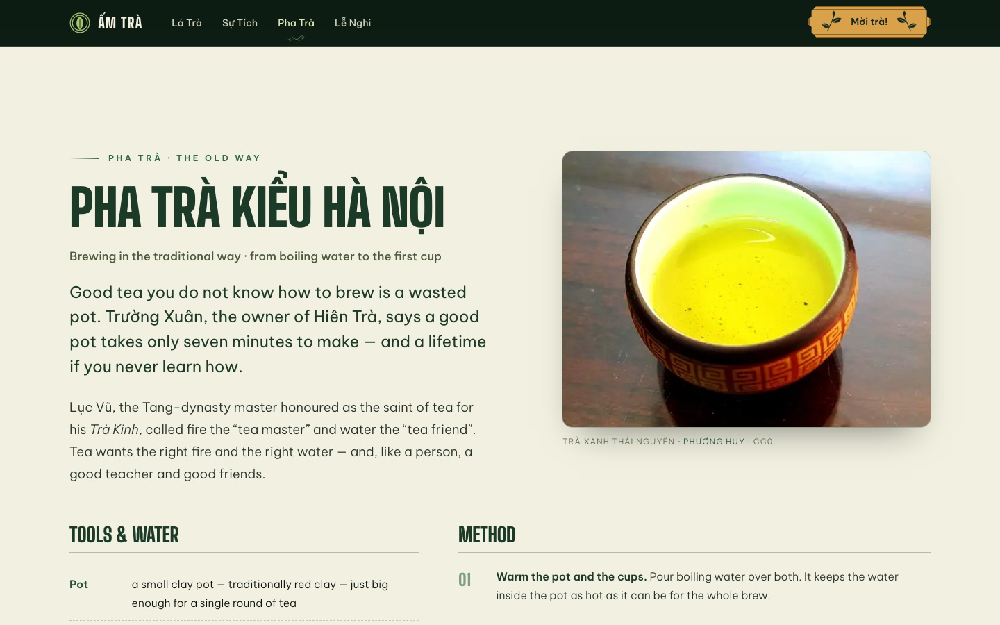</td>
    <td width="50%">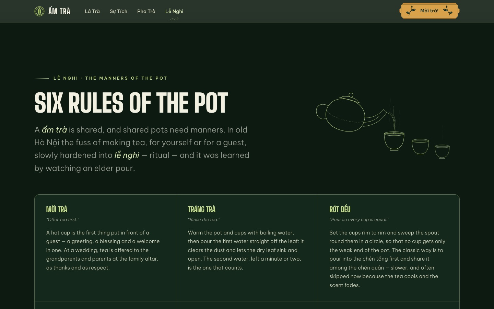</td>
  </tr>
  <tr>
    <td align="center"><b>Pha trà kiểu Hà Nội</b><br />Tools, water and the method, step by step.</td>
    <td align="center"><b>Six rules of the pot</b><br />The manners of offering tea.</td>
  </tr>
</table>

<details>
<summary><b>On a phone</b></summary>
<br />

<table>
  <tr>
    <td width="50%">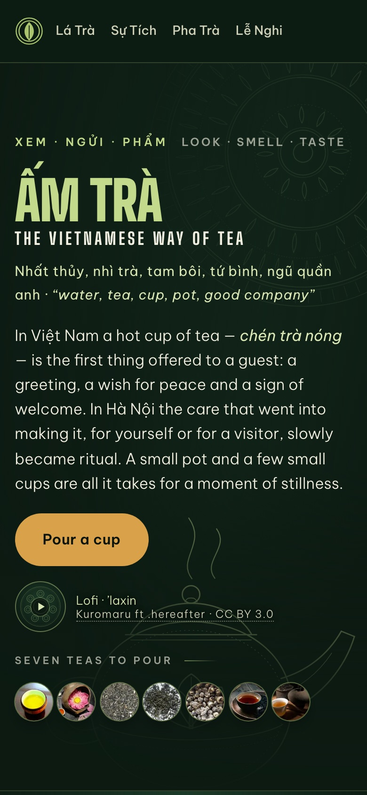</td>
    <td width="50%">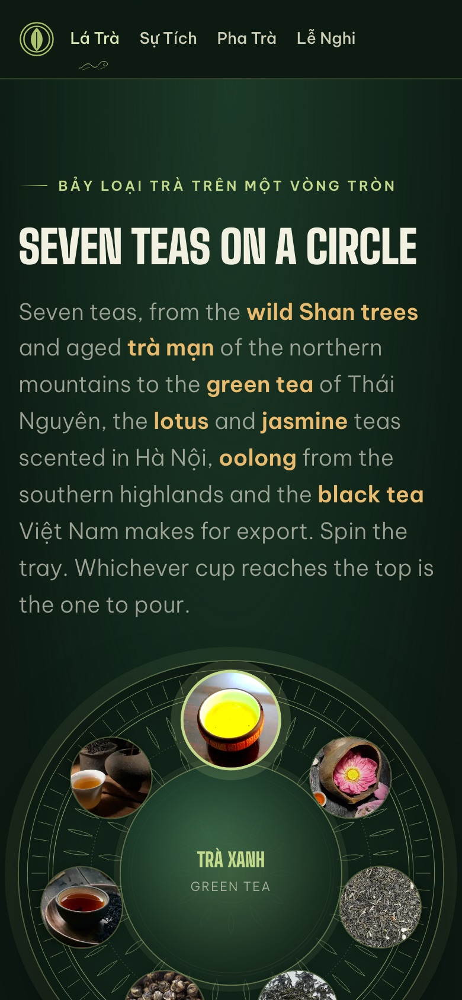</td>
  </tr>
</table>

</details>

<details>
<summary><b>The greeting</b></summary>
<br />

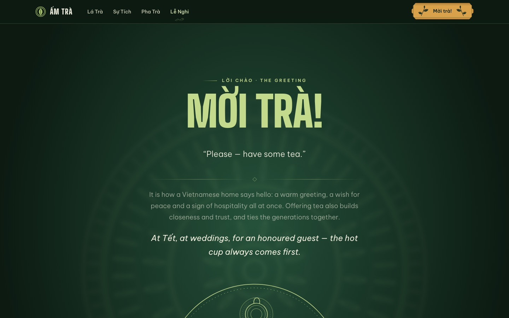

</details>

## Highlights

- **A teapot that draws itself.** The loading screen sketches a teapot line by line, lets steam rise and unfurls three leaves, then lifts like a curtain once the page and its fonts are ready. It carries a short bilingual note that the information may not be fully accurate.
- **A steam "cloud" in the navigation.** One little cloud glides along the header to whichever section you are reading. Hover a nav item to see its English meaning.
- **A tray you can spin.** Drag it, use the arrow keys, or click a cup. Each tea has its own card: where it grows, what it tastes like, how it is made.
- **Brew along.** The Method turns into a guided, step-by-step mode: pick one of the seven teas and it shows how much leaf, how hot the water and how long to wait, walks you through the seven steps, then runs a 60–90 second countdown for the second water with rising steam and a soft chime (plus a vibration on phones). It keeps the screen awake and counts against the clock, so it holds up on a phone beside the kettle.
- **Hear it said.** A small speaker button sits beside the Vietnamese tea names, the six manners, the four brewing gestures, the opening proverb and the "Mời trà!" greeting, because tones are hard to learn from spelling alone. Each plays a short pre-generated clip (`public/audio/vi/*.m4a`, made with `npm run audio`) so it sounds the same on every device; each also shows an approximate respelling for English readers, e.g. *Trà Xanh* (chah sang), kept in `components/speak/pronunciations.ts`. A phrase without a clip falls back to the device's own Vietnamese voice, and the button stays hidden where there is none.
- **A real 3D tea set.** A celadon pot and seven cups rendered with three.js, loaded only when you scroll near it.
- **Hand-drawn art.** The SVG illustrations are drawn from scratch and several animate with CSS inside the SVG file itself.
- **Background music.** A gentle lo-fi track, off until you press play.
- **Considerate by default.** Skip link, keyboard control of the tray, and reduced-motion support throughout.

## Sections

| Section | Folder | What it holds |
|---|---|---|
| Loader | `components/loader` | The self-drawing teapot loading screen |
| Header | `components/masthead` | Logo, navigation with a steam "cloud" that glides to the section in view, the "Mời trà!" plaque |
| Speak | `components/speak` | The speaker button (`Speak.tsx`) and the generated list of clips on disk (`recordings.ts`) |
| Hero | `components/hero` | Title, animated teapot drawing, strip of the seven teas, music button |
| Seven teas | `components/leaves` | A round tray you can spin (drag, arrow keys, click a cup) with a detail card for each tea |
| A full tea tray | `components/feast` | An interactive 3D tea tray (three.js) |
| Legend · Origins | `components/legend` | The history of tea in Việt Nam, with an animated drawing |
| Brew | `components/brew` | The traditional way of brewing, plus the guided "Brew along" mode with a countdown timer (`BrewGuide.tsx`; per-tea amounts and temperatures in `guide-data.ts`) |
| Manners | `components/manners` | Six rules for offering tea |
| The greeting | `components/closer` | "Mời trà!" |
| Footer | `components/credits` | A frieze that drifts sideways, plus photo and music credits |

## Tech

- [Next.js](https://nextjs.org) 16 (App Router) and React 19, written in TypeScript
- Tailwind CSS 4 for the base layer only; most of the styling is plain CSS, one `.css` file beside each component
- [three.js](https://threejs.org) for the 3D tray, loaded only when you scroll near it
- Be Vietnam Pro via `next/font`; Big Shoulders is self-hosted from `public/fonts/` with plain `@font-face` (in `app/globals.css`), because `next/font` has no size metrics for it and Turbopack warned on every build

> This version of Next.js differs a lot from older ones. Before changing anything framework-related, read the docs that ship in `node_modules/next/dist/docs/` (see also [AGENTS.md](AGENTS.md)).

## Getting started

Requires Node.js 20 or newer.

```bash
git clone https://github.com/trunkvn/tra-vn.git
cd tra-vn
npm install
npm run dev        # http://localhost:3001
```

| Command | What it does |
|---|---|
| `npm run dev` | Development server on port 3001 |
| `npm run build` | Production build |
| `npm run start` | Serve the production build on port 3001 |
| `npm run lint` | Lint with ESLint |
| `npm run audio` | Make the pronunciation clips that are missing (macOS only); add `-- --force` to remake all |

Measure performance on a `build` + `start`, never on `npm run dev`.

## Project layout

```
app/                  layout, home page, colour variables and shared styles (globals.css)
components/<section>/ each section's component and its CSS
components/leaves/    teas.ts (the seven teas), credits.ts (photo credits)
docs/screenshots/     the preview images used in this README
public/art/           hand-drawn SVGs (several animate with CSS inside the SVG file itself)
public/photos/        tea photographs
public/audio/         the background track; public/audio/vi/ holds the pronunciation clips (.m4a)
public/fonts/         the self-hosted display font (Big Shoulders, SIL Open Font License)
next.config.ts        cache headers for public/, allowed image qualities for next/image
```

## Pronunciation clips

`npm run audio` runs `scripts/generate-pronunciations.mjs`. It reads the list of phrases in that file, makes a clip for each one with the macOS Vietnamese voice (Linh, through `say` and `afconvert`) and rewrites `components/speak/recordings.ts` so the site knows which clips exist. To add a phrase, put a `<Speak text="…" />` button on the page, add the same phrase to the script and run it again; add its respelling to `components/speak/pronunciations.ts` too. The respellings are written by hand for a Hà Nội accent and are approximate — a native speaker should check them.

The voice is a system text-to-speech voice, so it sounds synthetic. To use a native speaker instead, save their recording over the clip with the same file name (the script never overwrites an existing clip unless you pass `--force`), or swap `synthesize()` in the script for a cloud text-to-speech service. Check the licence of whichever voice you use before the site goes public.

## A note on accuracy

The amounts, temperatures and wait times in "Brew along" are common rules of thumb for a small pot, not figures from the sources below; the guide says so on screen.

The page is a cultural introduction, not an academic source. Its text is drawn from articles by tea sellers and the trade press, and dates before the 20th century are approximate. The loading screen says as much, in Vietnamese and in English. Corrections are welcome.

## Credits and licences

- **Photos:** mostly from [Wikimedia Commons](https://commons.wikimedia.org/) under the licence each author chose (CC0, Public Domain, CC BY, CC BY-SA); the full list is in the footer and in `credits.ts`. **Three photos (lotus tea, mạn tea, black tea) come from Pinterest, and their author and licence could not be verified** — replace them with images you have the right to use before the site goes public.
- **Music:** "’laxin" (Lo Fi Background Music) by Kuromaru ft .hereafter, [CC BY 3.0](https://creativecommons.org/licenses/by/3.0/) via Wikimedia Commons, converted to MP3 and level-matched. CC BY requires crediting the author, so do not remove the credit line in the hero and the footer.
- **Text:** written from articles by [Thuận Trà Thái Nguyên](https://thuantrathainguyen.com/blogs/news/lich-su-tra-viet-nguon-goc-su-phat-trien), [Haba](https://haba.vn/van-hoa-uong-tra-cua-nguoi-viet/), [Kinh tế & Đồ uống](https://kinhtedouong.vn/le-nghi-trong-van-hoa-tra-viet-90208.html) and [Vinatea](https://travinatea.com.vn/blogs/van-hoa-tra/su-tinh-te-trong-cach-thuong-tra-cua-nguoi-ha-noi-xua). These are articles from tea sellers and the trade press, not academic histories, and dates before the 20th century are approximate. The English renderings of Vietnamese terms are the project author's own.
- **SVG drawings and the 3D model:** made for this project.
- **Screenshots** in `docs/screenshots/` were captured from the site itself and include the photos credited above.

<div align="center">

<br />

**Mời trà!** — *please, have some tea.*

</div>
